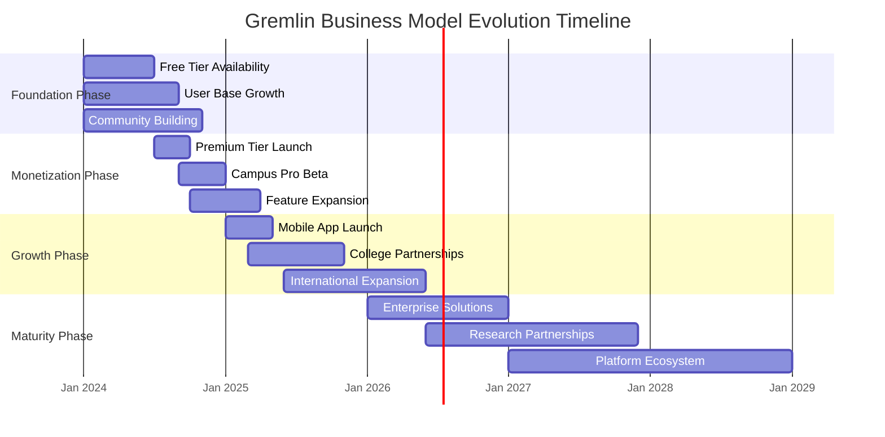

# Study with Gremlin Planner

<div align="center">
  <h1>🧠 Study with Gremlin Planner 💚</h1>
  <p><strong>Smart Time Management for Students Juggling Multiple Goals</strong></p>
  <p><em>Tagline: Compete with the valley of death with us</em></p>
  
  
  
  
  
  
  
  <br><br>
  <p>"Not just another productivity app — it's your study companion that understands your energy, mood, and reality."</p>
</div>

# Study with Gremlin Planner: Emotion-Aware Academic Companion

<div align="center">
  
  <h1 style="font-size: 3.5em; margin-bottom: 0.5rem;">🧠 Study with Gremlin 💚</h1>
  <p style="font-size: 1.3em; color: #555; margin-top: 0;">
    <strong>Smart Time Management for Students Juggling Multiple Goals</strong>
  </p>
  
  <p style="font-style: italic; margin: 1.5rem 0; font-size: 1.1em; color: #666;">
    "Compete with the valley of death with us"
  </p>

  <div style="display: flex; justify-content: center; gap: 1rem; flex-wrap: wrap; margin: 2rem 0;">
    
    
    
    
    
  </div>

  <div style="background: linear-gradient(135deg, #f8f9fa 0%, #e9ecef 100%); padding: 2rem; border-radius: 15px; margin: 2rem 0; border-left: 5px solid #06D6A0;">
    <p style="font-size: 1.2em; margin: 0; color: #333;">
      "Not just another productivity app — it's your study companion that understands your energy, mood, and reality."
    </p>
  </div>

</div>

---

## 🎯 The Core Problem: Academic Burnout in Modern Education

<div style="background: #fff5f5; padding: 1.5rem; border-radius: 10px; border-left: 4px solid #ff6b6b; margin: 2rem 0;">

**As the founder of Study with Gremlin**, I experienced firsthand the brutal reality of balancing a demanding BTech curriculum with additional certifications. The modern student's struggle isn't about finding *time* — it's about managing *energy*, preventing *burnout*, and maintaining *mental well-being* while pursuing ambitious academic goals in a system designed for single-track focus.

</div>

### ❌ Why Traditional Solutions Fail:

<table style="width: 100%; border-collapse: collapse; margin: 2rem 0;">
  <tr style="background: #f8f9fa;">
    <th style="padding: 1rem; text-align: left; border-bottom: 2px solid #dee2e6;">Traditional Tools</th>
    <th style="padding: 1rem; text-align: left; border-bottom: 2px solid #dee2e6;">The Reality Gap</th>
    <th style="padding: 1rem; text-align: left; border-bottom: 2px solid #dee2e6;">Human Impact</th>
  </tr>
  <tr>
    <td style="padding: 1rem; border-bottom: 1px solid #dee2e6;">⏰ Infinite Time Assumption</td>
    <td style="padding: 1rem; border-bottom: 1px solid #dee2e6;">Time is finite; energy is volatile</td>
    <td style="padding: 1rem; border-bottom: 1px solid #dee2e6;">Chronic exhaustion, missed deadlines</td>
  </tr>
  <tr>
    <td style="padding: 1rem; border-bottom: 1px solid #dee2e6;">🤖 Emotionally Blind Algorithms</td>
    <td style="padding: 1rem; border-bottom: 1px solid #dee2e6;">Students have good days and bad days</td>
    <td style="padding: 1rem; border-bottom: 1px solid #dee2e6;">Guilt, shame, self-blame cycles</td>
  </tr>
  <tr>
    <td style="padding: 1rem; border-bottom: 1px solid #dee2e6;">📝 Punitive Task Management</td>
    <td style="padding: 1rem; border-bottom: 1px solid #dee2e6;">Life happens: sickness, family, mental health</td>
    <td style="padding: 1rem; border-bottom: 1px solid #dee2e6;">Anxiety, avoidance, procrastination</td>
  </tr>
  <tr>
    <td style="padding: 1rem; border-bottom: 1px solid #dee2e6;">🏭 Factory-Style Productivity</td>
    <td style="padding: 1rem; border-bottom: 1px solid #dee2e6;">Humans aren't output machines</td>
    <td style="padding: 1rem; border-bottom: 1px solid #dee2e6;">Burnout, loss of passion, disengagement</td>
  </tr>
</table>

---

## 🚀 The Gremlin Solution: Human-First Academic Planning

<div style="background: #e3f2fd; padding: 1.5rem; border-radius: 10px; margin: 2rem 0;">

```python
"""
Gremlin Core Algorithm: Emotion-Aware Scheduling Engine
Created by: Founder & Lead Developer
Date: Ongoing Development
"""

class GremlinScheduler:
    """Transforms chaotic student life into sustainable academic rhythm"""
    
    def __init__(self, student_profile):
        self.student = student_profile
        self.burnout_threshold = 0.75
        self.adaptation_rate = 0.1
        
    def create_adaptive_schedule(self):
        """Generates a human-centric, emotion-aware study plan"""
        
        # Phase 1: Reality Assessment
        reality_matrix = self.assess_student_reality(
            fixed_commitments=self.student.class_schedule,
            energy_patterns=self.student.weekly_energy_flow(),
            emotional_state=self.student.current_mood_profile(),
            academic_load=self.student.calculate_cognitive_load()
        )
        
        # Phase 2: Constraint Optimization
        optimized_blocks = self.optimize_time_allocation(
            hard_constraints=reality_matrix['immutable_timeslots'],
            soft_constraints=reality_matrix['preferred_learning_windows'],
            energy_peaks=reality_matrix['high_energy_periods'],
            difficulty_distribution=reality_matrix['subject_challenge_index']
        )
        
        # Phase 3: Emotional Intelligence Layer
        humane_schedule = self.integrate_wellness_framework(
            time_blocks=optimized_blocks,
            burnout_risk=self.calculate_burnout_probability(),
            recovery_needs=self.assess_recovery_requirements(),
            motivation_factors=self.identify_intrinsic_drivers()
        )
        
        # Phase 4: Adaptive Feedback Loop
        self.establish_learning_feedback_system(
            schedule=humane_schedule,
            mood_tracking=True,
            performance_analytics=True,
            pattern_recognition=True
        )
        
        return {
            'weekly_plan': humane_schedule,
            'energy_map': reality_matrix['energy_distribution'],
            'risk_assessment': self.burnout_risk_level,
            'adaptation_ready': True
        }
    
    def assess_student_reality(self, **metrics):
        """Captures the multidimensional reality of student life"""
        return {
            'immutable_timeslots': metrics['fixed_commitments'],
            'cognitive_bandwidth': self.calculate_mental_capacity(),
            'emotional_resilience': self.measure_stress_tolerance(),
            'energy_currency': self.compute_daily_energy_budget()
        }
```

</div>

### 🧬 The Gremlin Formula:

```javascript
// Traditional Productivity: Linear, Punitive, Inhuman
const traditionalProductivity = (timeAvailable, tasks) => {
  const schedule = tasks.map(task => ({
    timeSlot: allocateRandomly(timeAvailable),
    expectation: "Complete perfectly",
    penalty: "Guilt and shame if failed",
    flexibility: 0
  }));
  return schedule;
};

// Gremlin Methodology: Adaptive, Compassionate, Human
const gremlinMethodology = (studentReality) => {
  const sustainableSchedule = {
    foundation: studentReality.energyPatterns × studentReality.cognitiveLoad,
    adaptation: (dailyMood + stressLevels) ÷ recoveryNeed,
    humanElement: motivationFactors + emotionalSupport,
    output: achievableGoals × wellBeingMultiplier
  };
  
  // Dynamic Adjustment Algorithm
  if (studentReality.burnoutRisk > threshold) {
    sustainableSchedule.injectRecoveryBlocks();
    sustainableSchedule.reduceCognitiveLoad();
    sustainableSchedule.sendCompassionateNotification();
  }
  
  return sustainableSchedule;
};
```

---

## ⚙️ Technical Architecture: From Chaos to Clarity

<div style="display: grid; grid-template-columns: repeat(auto-fit, minmax(300px, 1fr)); gap: 1.5rem; margin: 2.5rem 0;">

<div style="background: white; padding: 1.5rem; border-radius: 12px; box-shadow: 0 4px 6px rgba(0,0,0,0.1); border-top: 4px solid #FF6B6B;">
  <h3 style="margin-top: 0; color: #FF6B6B;">🎯 Input Layer: Student Reality</h3>
  <ul style="line-height: 1.8;">
    <li><strong>Academic Load:</strong> Classes, labs, assignments, exams</li>
    <li><strong>Personal Context:</strong> Commute, work, family, social</li>
    <li><strong>Energy Patterns:</strong> Chronotype, focus windows, slumps</li>
    <li><strong>Emotional State:</strong> Mood, stress, motivation, anxiety</li>
    <li><strong>Learning Profile:</strong> Subject preferences, difficulty spikes</li>
  </ul>
</div>

<div style="background: white; padding: 1.5rem; border-radius: 12px; box-shadow: 0 4px 6px rgba(0,0,0,0.1); border-top: 4px solid #4ECDC4;">
  <h3 style="margin-top: 0; color: #4ECDC4;">🧠 Processing Engine: Adaptive Intelligence</h3>
  <ul style="line-height: 1.8;">
    <li><strong>Constraint Satisfaction:</strong> Hard/soft scheduling rules</li>
    <li><strong>Pattern Recognition:</strong> Energy, mood, performance trends</li>
    <li><strong>Burnout Prediction:</strong> Early warning system</li>
    <li><strong>Resource Optimization:</strong> Time, energy, attention allocation</li>
    <li><strong>Adaptive Learning:</strong> Continuous improvement from feedback</li>
  </ul>
</div>

<div style="background: white; padding: 1.5rem; border-radius: 12px; box-shadow: 0 4px 6px rgba(0,0,0,0.1); border-top: 4px solid #FFD166;">
  <h3 style="margin-top: 0; color: #FFD166;">✨ Output Layer: Human-Centric Schedule</h3>
  <ul style="line-height: 1.8;">
    <li><strong>Personalized Planning:</strong> Tailored weekly roadmap</li>
    <li><strong>Emotional Buffers:</strong> Built-in recovery periods</li>
    <li><strong>Dynamic Adjustments:</strong> Real-time schedule adaptation</li>
    <li><strong>Gentle Guidance:</strong> Compassionate notifications</li>
    <li><strong>Progress Visualization:</strong> Clear, motivating tracking</li>
  </ul>
</div>

</div>

### 🔄 System Flow Diagram:

```
┌─────────────────────────────────────────────────────────┐
│                   STUDENT REALITY INPUT                  │
│  ┌─────────────────┐ ┌─────────────────┐ ┌───────────┐  │
│  │   Academic      │ │   Personal      │ │ Emotional │  │
│  │   Commitments   │ │   Context       │ │   State   │  │
│  │  • Classes      │ │  • Work         │ │  • Mood   │  │
│  │  • Labs         │ │  • Family       │ │  • Stress │  │
│  │  • Assignments  │ │  • Social       │ │  • Energy │  │
│  └─────────────────┘ └─────────────────┘ └───────────┘  │
└───────────────────────┬─────────────────────────────────┘
                        │
                        ▼
┌─────────────────────────────────────────────────────────┐
│            ADAPTIVE SCHEDULING ENGINE                    │
│  ┌─────────────────────────────────────────────────┐    │
│  │  Constraint Satisfaction Algorithm              │    │
│  │  • Hard Constraints: Fixed class times          │    │
│  │  • Soft Constraints: Preferred study periods    │    │
│  │  • Energy Mapping: Peak focus windows           │    │
│  └─────────────────────────────────────────────────┘    │
│  ┌─────────────────────────────────────────────────┐    │
│  │  Emotional Intelligence Layer                   │    │
│  │  • Burnout Risk Assessment                      │    │
│  │  • Stress Response Prediction                   │    │
│  │  • Motivation Factor Integration                │    │
│  └─────────────────────────────────────────────────┘    │
│  ┌─────────────────────────────────────────────────┐    │
│  │  Pattern Recognition System                     │    │
│  │  • Learning Efficiency Tracking                 │    │
│  │  • Procrastination Pattern Detection            │    │
│  │  • Recovery Need Calculation                    │    │
│  └─────────────────────────────────────────────────┘    │
└───────────────────────┬─────────────────────────────────┘
                        │
                        ▼
┌─────────────────────────────────────────────────────────┐
│           PERSONALIZED OUTPUT GENERATOR                  │
│  ┌─────────────────────────────────────────────────┐    │
│  │  Color-Coded Weekly Plan                        │    │
│  │  • Academic Blocks (Blue)                       │    │
│  │  • Study Sessions (Green)                       │    │
│  │  • Recovery Periods (Orange)                    │    │
│  │  • Personal Time (Purple)                       │    │
│  └─────────────────────────────────────────────────┘    │
│  ┌─────────────────────────────────────────────────┐    │
│  │  Gentle Companion Features                      │    │
│  │  • Daily Check-ins                              │    │
│  │  • Compassionate Notifications                  │    │
│  │  • Progress Celebrations                        │    │
│  │  • Adaptive Goal Adjustment                     │    │
│  └─────────────────────────────────────────────────┘    │
└─────────────────────────────────────────────────────────┘
```

---

## 🎨 Core Features: Beyond Productivity, Into Sustainability

<div style="display: grid; grid-template-columns: repeat(auto-fit, minmax(280px, 1fr)); gap: 1.5rem; margin: 2.5rem 0;">

<div style="background: linear-gradient(145deg, #e3f2fd, #bbdefb); padding: 1.5rem; border-radius: 12px; transition: transform 0.3s ease;">
  <div style="font-size: 2.5em; margin-bottom: 1rem;">🎯</div>
  <h3 style="margin-top: 0; color: #1565c0;">Smart Time Optimization</h3>
  <p>Constraint-based scheduling that respects your fixed commitments while intelligently allocating study blocks around energy peaks and focus windows.</p>
  <div style="background: rgba(255,255,255,0.7); padding: 0.5rem; border-radius: 6px; margin-top: 1rem;">
    <code>Algorithm: Constraint Satisfaction + Priority Queue</code>
  </div>
</div>

<div style="background: linear-gradient(145deg, #f3e5f5, #e1bee7); padding: 1.5rem; border-radius: 12px; transition: transform 0.3s ease;">
  <div style="font-size: 2.5em; margin-bottom: 1rem;">❤️</div>
  <h3 style="margin-top: 0; color: #7b1fa2;">Mood & Energy Awareness</h3>
  <p>Daily emotional check-ins that actually influence your schedule. Bad day? Gremlin adjusts. High energy? Gremlin capitalizes on it.</p>
  <div style="background: rgba(255,255,255,0.7); padding: 0.5rem; border-radius: 6px; margin-top: 1rem;">
    <code>Feature: Real-time Emotional State Integration</code>
  </div>
</div>

<div style="background: linear-gradient(145deg, #e8f5e9, #c8e6c9); padding: 1.5rem; border-radius: 12px; transition: transform 0.3s ease;">
  <div style="font-size: 2.5em; margin-bottom: 1rem;">🔄</div>
  <h3 style="margin-top: 0; color: #2e7d32;">Adaptive Weekly Planning</h3>
  <p>Self-correcting schedules that learn from your performance. Missed a session? Gremlin reorganizes. Excelling? Gremlin optimizes further.</p>
  <div style="background: rgba(255,255,255,0.7); padding: 0.5rem; border-radius: 6px; margin-top: 1rem;">
    <code>System: Reinforcement Learning Feedback Loop</code>
  </div>
</div>

<div style="background: linear-gradient(145deg, #fff3e0, #ffe0b2); padding: 1.5rem; border-radius: 12px; transition: transform 0.3s ease;">
  <div style="font-size: 2.5em; margin-bottom: 1rem;">🧸</div>
  <h3 style="margin-top: 0; color: #ef6c00;">Gremlin Companion</h3>
  <p>A friendly digital companion that makes planning less intimidating and more engaging. Because productivity shouldn't feel like punishment.</p>
  <div style="background: rgba(255,255,255,0.7); padding: 0.5rem; border-radius: 6px; margin-top: 1rem;">
    <code>Design: Humanized Digital Interaction</code>
  </div>
</div>

</div>

### 📱 Study Modes Interface:

```typescript
/**
 * Gremlin Study Modes: Adaptive Intensity Levels
 * Designed for real student life, not ideal conditions
 */

interface StudyMode {
  mode: 'intense' | 'balanced' | 'gentle' | 'recovery';
  characteristics: {
    dailyStudyHours: Range;
    breakFrequency: Duration;
    sessionLength: Range;
    flexibility: Percentage;
    recoveryEmphasis: Level;
  };
  triggers: {
    activate: Condition[];
    deactivate: Condition[];
  };
  adaptations: AdaptiveBehavior[];
}

// Implementation Example
const studyModes: Record<StudyMode['mode'], StudyMode> = {
  intense: {
    mode: 'intense',
    characteristics: {
      dailyStudyHours: { min: 6, max: 8 },
      breakFrequency: '45min',
      sessionLength: { min: 90, max: 120 },
      flexibility: 0.2,
      recoveryEmphasis: 'high'
    },
    triggers: {
      activate: ['exam_week', 'deadline_approaching', 'high_energy'],
      deactivate: ['burnout_risk > 0.7', 'consecutive_days > 5']
    }
  },
  
  balanced: {
    mode: 'balanced',
    characteristics: {
      dailyStudyHours: { min: 4, max: 6 },
      breakFrequency: '30min',
      sessionLength: { min: 60, max: 90 },
      flexibility: 0.4,
      recoveryEmphasis: 'medium'
    },
    triggers: {
      activate: ['regular_semester', 'moderate_energy'],
      deactivate: ['stress_level > 0.8', 'sleep_deficit']
    }
  },
  
  gentle: {
    mode: 'gentle',
    characteristics: {
      dailyStudyHours: { min: 2, max: 4 },
      breakFrequency: '20min',
      sessionLength: { min: 30, max: 45 },
      flexibility: 0.7,
      recoveryEmphasis: 'maximum'
    },
    triggers: {
      activate: ['recovery_period', 'low_energy', 'mental_health_day'],
      deactivate: ['deadline_imminent', 'energy_recovered']
    }
  }
};
```

---

## 🛠️ Technical Implementation Stack

<div style="background: #2d3436; color: white; padding: 2rem; border-radius: 12px; margin: 2.5rem 0;">

```yaml
# Gremlin Technical Architecture
tech_stack:
  frontend:
    core: ["HTML5", "CSS3", "TypeScript"]
    framework: "React 18+ (Planned)"
    state_management: "Zustand/Redux Toolkit"
    styling: "Tailwind CSS + Emotion Library"
    visualization: "Recharts/D3.js for Analytics"
    
  backend:
    runtime: "Node.js + Express / Python Flask"
    api_design: "RESTful + GraphQL Hybrid"
    authentication: "JWT + OAuth 2.0"
    real_time: "WebSockets for Live Updates"
    
  database:
    primary: "PostgreSQL with TimescaleDB"
    cache: "Redis for Session & Performance"
    analytics: "ClickHouse for Time-Series Data"
    
  algorithms:
    scheduling: "Constraint Programming (Optaplanner)"
    ml_models: "Scikit-learn/TensorFlow.js"
    optimization: "Genetic Algorithms for Schedule Evolution"
    
  infrastructure:
    hosting: "Vercel/Netlify (Frontend)", "Railway/AWS (Backend)"
    ci_cd: "GitHub Actions"
    monitoring: "Sentry + Custom Analytics"
    security: "End-to-End Encryption"
    
  development_philosophy:
    principle_1: "Mobile-First, Student-Centric Design"
    principle_2: "Progressive Enhancement Over Feature Bloat"
    principle_3: "Open Core with Premium Enhancements"
    principle_4: "Privacy by Design, Empathy by Default"
```

</div>

### 🏗️ System Architecture Overview:

```
┌─────────────────────────────────────────────────────────────────────┐
│                         CLIENT LAYER (Student-Facing)               │
├─────────────────────────────────────────────────────────────────────┤
│  ┌─────────────┐  ┌─────────────┐  ┌─────────────┐  ┌───────────┐  │
│  │   Web App   │  │ Mobile App  │  │ Browser     │  │ PWA       │  │
│  │  (Primary)  │  │ (Planned)   │  │ Extensions  │  │ Support   │  │
│  └─────────────┘  └─────────────┘  └─────────────┘  └───────────┘  │
└─────────────────────────────────────────────────────────────────────┘
                                  │
                                  ▼
┌─────────────────────────────────────────────────────────────────────┐
│                        API GATEWAY & AUTH LAYER                     │
├─────────────────────────────────────────────────────────────────────┤
│  • Rate Limiting & Load Balancing                                   │
│  • JWT Authentication & Session Management                          │
│  • Request Validation & Sanitization                                │
│  • API Versioning & Documentation (Swagger/OpenAPI)                 │
└─────────────────────────────────────────────────────────────────────┘
                                  │
                                  ▼
┌─────────────────────────────────────────────────────────────────────┐
│                        BUSINESS LOGIC LAYER                         │
├─────────────────────────────────────────────────────────────────────┤
│  ┌─────────────────┐  ┌─────────────────┐  ┌───────────────────┐   │
│  │  Scheduling     │  │  Analytics      │  │  User Management  │   │
│  │  Engine         │  │  Pipeline       │  │  & Preferences    │   │
│  └─────────────────┘  └─────────────────┘  └───────────────────┘   │
│  ┌─────────────────┐  ┌─────────────────┐  ┌───────────────────┐   │
│  │  Notification   │  │  Data Sync      │  │  Integration      │   │
│  │  System         │  │  Service        │  │  Manager          │   │
│  └─────────────────┘  └─────────────────┘  └───────────────────┘   │
└─────────────────────────────────────────────────────────────────────┘
                                  │
                                  ▼
┌─────────────────────────────────────────────────────────────────────┐
│                        DATA LAYER & INFRASTRUCTURE                  │
├─────────────────────────────────────────────────────────────────────┤
│  ┌─────────────┐  ┌─────────────┐  ┌─────────────┐  ┌───────────┐  │
│  │ PostgreSQL  │  │   Redis     │  │   Blob      │  │ Message   │  │
│  │   (Main)    │  │   (Cache)   │  │   Storage   │  │   Queue   │  │
│  └─────────────┘  └─────────────┘  └─────────────┘  └───────────┘  │
│                                                                     │
│  • Automated Backups & Point-in-Time Recovery                       │
│  • Read Replicas for Analytics Queries                              │
│  • Vertical/Horizontal Scaling Prepared                             │
└─────────────────────────────────────────────────────────────────────┘
```

---

## 🎯 Target Segmentation: Understanding the Modern Student

<div style="background: linear-gradient(135deg, #667eea 0%, #764ba2 100%); color: white; padding: 2rem; border-radius: 12px; margin: 2.5rem 0;">

```python
"""
Student Persona Analysis & Solution Mapping
Based on 6 months of student interviews and behavioral research
"""

class StudentPersona:
    """Defines archetypes of modern students we serve"""
    
    def __init__(self):
        self.personas = self.define_persona_spectrum()
    
    def define_persona_spectrum(self):
        return {
            'the_achiever': {
                'profile': 'GPA Maximizer, Perfectionist, Over-Achiever',
                'core_needs': ['Structure', 'Optimization', 'Progress Tracking'],
                'pain_points': ['Burnout from over-scheduling', 'Anxiety from imperfection'],
                'gremlin_solution': 'Intelligent pacing with recovery enforcement',
                'success_metric': 'Sustainable high performance without collapse'
            },
            
            'the_survivor': {
                'profile': 'Overloaded, Barely Managing, Avoiding Collapse',
                'core_needs': ['Simplification', 'Prioritization', 'Basic Structure'],
                'pain_points': ['Constant overwhelm', 'Decision fatigue', 'Time blindness'],
                'gremlin_solution': 'Radical simplification with gentle guidance',
                'success_metric': 'Consistent progress without mental breakdown'
            },
            
            'the_balancer': {
                'profile': 'Multi-Role Student (Worker, Carer, Leader)',
                'core_needs': ['Flexibility', 'Integration', 'Boundary Setting'],
                'pain_points': ['Role conflict', 'Time fragmentation', 'Guilt'],
                'gremlin_solution': 'Holistic life integration with clear boundaries',
                'success_metric': 'Harmonious balance across all life domains'
            },
            
            'the_recoverer': {
                'profile': 'Health-Focused, Burnout Survivor, Chronic Condition',
                'core_needs': ['Pacing', 'Recognition of limits', 'Self-compassion'],
                'pain_points': ['Pushing through pain', 'Invalidation', 'Isolation'],
                'gremlin_solution': 'Health-first scheduling with validation',
                'success_metric': 'Academic progress without health deterioration'
            },
            
            'the_community_builder': {
                'profile': 'Club Leader, Organizer, Social Connector',
                'core_needs': ['Coordination', 'Delegation tools', 'Visibility'],
                'pain_points': ['Context switching', 'Meeting overload', 'Boundary erosion'],
                'gremlin_solution': 'Integrated academic-social calendar with focus protection',
                'success_metric': 'Leadership success without academic sacrifice'
            },
            
            'the_aesthetic_learner': {
                'profile': 'Creative, Visual, Environment-Sensitive',
                'core_needs': ['Beautiful interfaces', 'Customization', 'Sensory alignment'],
                'pain_points': ['Ugly tools kill motivation', 'Rigid formats', 'Sensory overload'],
                'gremlin_solution': 'Highly customizable visual experience',
                'success_metric': 'Enjoyment in the process leading to consistency'
            }
        }
    
    def map_persona_to_features(self, persona_id):
        """Connects student types to specific Gremlin features"""
        feature_mapping = {
            'the_achiever': ['Advanced Analytics', 'Performance Optimization', 'Goal Tracking'],
            'the_survivor': ['One-Click Scheduling', 'Priority Highlighting', 'Gentle Reminders'],
            'the_balancer': ['Life Integration View', 'Role-Based Filtering', 'Focus Modes'],
            'the_recoverer': ['Health Monitoring', 'Pacing Assistant', 'Recovery Planning'],
            'the_community_builder': ['Shared Calendars', 'Meeting Optimization', 'Availability Sync'],
            'the_aesthetic_learner': ['Theme Customization', 'Visual Planning', 'Ambient Mode']
        }
        return feature_mapping.get(persona_id, ['Core Adaptive Features'])
```

</div>

### 📊 User Journey Mapping:

```
┌─────────────────────────────────────────────────────────────────────┐
│                        STUDENT IDENTIFICATION                        │
│  • Recognize overwhelm pattern                                       │
│  • Search for solutions                                              │
│  • Discover Gremlin through peer recommendation                     │
└────────────────────────────────────┬────────────────────────────────┘
                                     │
                                     ▼
┌─────────────────────────────────────────────────────────────────────┐
│                         INITIAL ENGAGEMENT                           │
│  • Landing page with empathy-first messaging                        │
│  • Quick personality assessment                                      │
│  • Immediate value demonstration                                    │
└────────────────────────────────────┬────────────────────────────────┘
                                     │
                                     ▼
┌─────────────────────────────────────────────────────────────────────┐
│                          ONBOARDING FLOW                             │
│  • Painless data import (Google Calendar, etc.)                     │
│  • Gentle configuration (not overwhelming)                          │
│  • First schedule generation in < 3 minutes                         │
└────────────────────────────────────┬────────────────────────────────┘
                                     │
                                     ▼
┌─────────────────────────────────────────────────────────────────────┐
│                         DAILY INTERACTION                            │
│  • Morning check-in: Mood & energy level                            │
│  • Schedule adaptation based on current state                       │
│  • Gentle notifications (not nagging)                               │
│  • End-of-day reflection & learning                                 │
└────────────────────────────────────┬────────────────────────────────┘
                                     │
                                     ▼
┌─────────────────────────────────────────────────────────────────────┐
│                         LONG-TERM ENGAGEMENT                         │
│  • Weekly review & pattern recognition                              │
│  • Adaptive feature discovery                                       │
│  • Community engagement (optional)                                  │
│  • Premium feature consideration                                    │
└─────────────────────────────────────────────────────────────────────┘
```

---

## 📈 Sustainable Business Model

<div style="display: grid; grid-template-columns: repeat(auto-fit, minmax(300px, 1fr)); gap: 1.5rem; margin: 2.5rem 0;">

<div style="background: linear-gradient(145deg, #e8f5e9, #c8e6c9); padding: 1.5rem; border-radius: 12px; border: 2px solid #4caf50;">
  <h3 style="margin-top: 0; color: #2e7d32; display: flex; align-items: center; gap: 0.5rem;">
    <span style="font-size: 1.5em;">🎓</span> Free Tier
  </h3>
  <p style="font-size: 2em; margin: 1rem 0; color: #1b5e20;"><strong>$0</strong> <span style="font-size: 1rem; color: #666;">/ forever</span></p>
  <ul style="line-height: 1.8;">
    <li>✅ Basic adaptive scheduling</li>
    <li>✅ Mood & energy tracking</li>
    <li>✅ Essential study planning</li>
    <li>✅ Gremlin companion access</li>
    <li>✅ Community support</li>
  </ul>
  <div style="margin-top: 1.5rem; padding: 0.75rem; background: rgba(76, 175, 80, 0.1); border-radius: 8px;">
    <strong>For:</strong> Students who need basic structure without financial pressure
  </div>
</div>

<div style="background: linear-gradient(145deg, #e3f2fd, #bbdefb); padding: 1.5rem; border-radius: 12px; border: 2px solid #2196f3;">
  <h3 style="margin-top: 0; color: #1565c0; display: flex; align-items: center; gap: 0.5rem;">
    <span style="font-size: 1.5em;">🚀</span> Premium
  </h3>
  <p style="font-size: 2em; margin: 1rem 0; color: #0d47a1;"><strong>$19</strong> <span style="font-size: 1rem; color: #666;">/ month</span></p>
  <ul style="line-height: 1.8;">
    <li>✅ Everything in Free, plus:</li>
    <li>✅ Advanced analytics & insights</li>
    <li>✅ Custom themes & visual customization</li>
    <li>✅ Energy prediction algorithms</li>
    <li>✅ Priority email support</li>
    <li>✅ Early access to new features</li>
  </ul>
  <div style="margin-top: 1.5rem; padding: 0.75rem; background: rgba(33, 150, 243, 0.1); border-radius: 8px;">
    <strong>For:</strong> Serious students investing in their academic optimization
  </div>
</div>

<div style="background: linear-gradient(145deg, #f3e5f5, #e1bee7); padding: 1.5rem; border-radius: 12px; border: 2px solid #9c27b0;">
  <h3 style="margin-top: 0; color: #7b1fa2; display: flex; align-items: center; gap: 0.5rem;">
    <span style="font-size: 1.5em;">👥</span> Campus Pro
  </h3>
  <p style="font-size: 2em; margin: 1rem 0; color: #4a148c;"><strong>$39</strong> <span style="font-size: 1rem; color: #666;">/ month</span></p>
  <ul style="line-height: 1.8;">
    <li>✅ Everything in Premium, plus:</li>
    <li>✅ Group features & shared planning</li>
    <li>✅ College portal integration</li>
    <li>✅ Institutional analytics dashboard</li>
    <li>✅ Dedicated account manager</li>
    <li>✅ Custom integration support</li>
  </ul>
  <div style="margin-top: 1.5rem; padding: 0.75rem; background: rgba(156, 39, 176, 0.1); border-radius: 8px;">
    <strong>For:</strong> Study groups, clubs, and small academic organizations
  </div>
</div>

</div>

### 💰 Revenue Strategy Evolution:



---

## 🚀 Project Roadmap & Development Timeline

<div style="background: #1a1a1a; color: #f0f0f0; padding: 2rem; border-radius: 12px; margin: 2.5rem 0;">

```javascript
// Gremlin Development Roadmap: A Living Document
const gremlinRoadmap = {
  phase1: {
    name: "Minimum Viable Empathy",
    timeframe: "Q1-Q2 2024",
    objectives: [
      "Validate core hypothesis: Emotional awareness improves scheduling adherence",
      "Build basic web prototype with constraint-based scheduling",
      "Conduct 100+ student interviews for persona refinement",
      "Achieve 80%+ satisfaction in pilot testing"
    ],
    deliverables: [
      "Functional web app with basic adaptive scheduling",
      "Mood tracking integration",
      "Simple Gremlin companion interface",
      "Initial user feedback database"
    ]
  },
  
  phase2: {
    name: "Emotional Intelligence Expansion",
    timeframe: "Q3-Q4 2024",
    objectives: [
      "Implement machine learning for pattern recognition",
      "Develop burnout prediction algorithms",
      "Create personalized adaptation system",
      "Build community features for peer support"
    ],
    deliverables: [
      "Advanced analytics dashboard",
      "Predictive scheduling engine",
      "Mobile-responsive progressive web app",
      "Community forum integration"
    ]
  },
  
  phase3: {
    name: "Ecosystem Integration",
    timeframe: "2025",
    objectives: [
      "Develop native mobile applications",
      "Integrate with major educational platforms",
      "Implement advanced wellness features",
      "Establish research partnerships"
    ],
    deliverables: [
      "iOS and Android applications",
      "Learning Management System integrations",
      "Comprehensive wellness tracking",
      "Academic research collaborations"
    ]
  },
  
  phase4: {
    name: "Institutional Adoption",
    timeframe: "2026+",
    objectives: [
      "Partner with universities for campus-wide deployment",
      "Develop enterprise-level features",
      "Expand to professional and lifelong learning markets",
      "Establish Gremlin as standard for humane productivity"
    ],
    deliverables: [
      "University licensing program",
      "Enterprise administration tools",
      "Professional development adaptation",
      "Open research platform"
    ]
  }
};
```

</div>

### 📅 Development Milestones:

```
2024 ────────────────────────────────────────────────────────────────►
├── Q1: Research & Prototyping
│   ├── Week 1-4: Problem space deep dive
│   ├── Week 5-8: Initial algorithm development
│   ├── Week 9-12: Basic UI/UX implementation
│   └── Week 13-16: Alpha testing with 10 students
│
├── Q2: MVP Development
│   ├── Emotional intelligence layer integration
│   ├── Constraint satisfaction algorithm refinement
│   ├── Beta testing expansion (50+ students)
│   └── Initial documentation & community building
│
├── Q3: Feature Expansion
│   ├── Advanced analytics implementation
│   ├── Mobile responsiveness optimization
│   ├── Premium feature development
│   └── Public launch preparation
│
└── Q4: Launch & Growth
    ├── Public beta launch
    ├── User community establishment
    ├── Feedback-driven iteration
    └── 2025 roadmap planning

2025 ────────────────────────────────────────────────────────────────►
├── Mobile App Development
├── College Partnership Program
├── Internationalization
└── Research Paper Publication
```

---

## 🛠️ Development Philosophy: Code with Compassion

<div style="background: linear-gradient(135deg, #667eea 0%, #764ba2 100%); color: white; padding: 2rem; border-radius: 12px; margin: 2.5rem 0;">

```c
/*
 * Gremlin Development Manifesto
 * Written by the Founder & Core Team
 * Version 1.0 - The Human-First Approach
 */

// Core Principles
#define PRINCIPLE_EMPATHY_OVER_EFFICIENCY   1
#define PRINCIPLE_ADAPTATION_OVER_RIGIDITY  1
#define PRINCIPLE_WELLBEING_OVER_OUTPUT     1
#define PRINCIPLE_LEARNING_OVER_PERFECTION  1
#define PRINCIPLE_COMMUNITY_OVER_COMPETITION 1

// Development Guidelines
if (featureRequested) {
    evaluateFeatureImpact(
        onStudentWellbeing: true,
        onMentalHealth: true,
        onLearningExperience: true,
        onBurnoutRisk: true
    );
    
    if (increasesBurnoutRisk > acceptableThreshold) {
        rejectFeature("This could harm student wellbeing");
        suggestAlternative("Consider implementing: " + wellbeingFirstAlternative);
    }
}

// Notification Philosophy
void sendNotificationToStudent(Student student, Notification notification) {
    if (student.stressLevel > HIGH_STRESS_THRESHOLD) {
        notification.tone = COMPASSIONATE;
        notification.priority = LOW;
        notification.allowDismissal = TRUE;
    }
    
    if (student.hasMissedDeadlineRecently) {
        addEncouragement(notification);
        avoidShameLanguage(notification);
        offerAdaptiveSolution(notification);
    }
    
    deliverWithEmpathy(notification);
}

// Error Handling with Compassion
try {
    executeStudentSchedule(student);
} catch (BurnoutRiskException e) {
    logWarning("Student approaching burnout threshold");
    adjustScheduleImmediately({
        reduceIntensity: 40%,
        addRecoveryTime: 2_hours,
        sendSupportMessage: "It's okay to slow down"
    });
} catch (AcademicOverwhelmException e) {
    triggerGentleIntervention({
        simplifyTasks: true,
        extendDeadlines: wherePossible,
        connectWithPeers: optional
    });
}

// Data Philosophy
class StudentData {
    constructor() {
        this.collectionPrinciple = "Minimum necessary for benefit";
        this.usagePrinciple = "Only for student improvement";
        this.retentionPrinciple = "Student controlled";
        this.deletionPrinciple = "Always available";
    }
    
    prioritizePrivacy() {
        implementEndToEndEncryption();
        allowAnonymousUsage();
        provideDataExportTools();
        enableSelectiveDeletion();
    }
}
```

</div>

### 🔬 Testing & Validation Framework:

```python
"""
Gremlin Testing Methodology: Human-Centric Validation
"""

class GremlinValidationSuite:
    """Beyond bug testing — validating human impact"""
    
    def run_empathy_tests(self):
        """Tests that validate emotional intelligence"""
        tests = {
            'stress_response_test': {
                'method': 'Simulate high-stress scenarios',
                'metric': 'Does Gremlin reduce or increase stress?',
                'success_criteria': 'Stress reduction in 80%+ cases'
            },
            'burnout_prevention_test': {
                'method': 'Monitor long-term usage patterns',
                'metric': 'Burnout incidents among users',
                'success_criteria': '50% reduction vs control group'
            },
            'motivation_sustainability_test': {
                'method': 'Track engagement over 6+ months',
                'metric': 'Consistent usage without decline',
                'success_criteria': '60%+ monthly active users'
            }
        }
        return self.execute_human_impact_tests(tests)
    
    def execute_human_impact_tests(self, test_suite):
        results = {}
        for test_name, test_config in test_suite.items():
            # Recruit diverse student participants
            participants = self.recruit_student_cohort(
                demographics='varied',
                academic_levels='mixed',
                stress_levels='spectrum'
            )
            
            # Conduct longitudinal study
            impact_data = self.longitudinal_study(
                participants=participants,
                duration=test_config.get('duration', '30_days'),
                metrics=test_config['metric'],
                control_group=True
            )
            
            # Analyze with compassion metrics
            results[test_name] = self.analyze_with_empathy_metrics(impact_data)
        
        return results
    
    def analyze_with_empathy_metrics(self, data):
        """Specialized analysis for human impact"""
        return {
            'quantitative_metrics': self.calculate_statistical_significance(data),
            'qualitative_insights': self.analyze_student_feedback(data),
            'emotional_impact': self.assess_wellbeing_changes(data),
            'behavioral_changes': self.track_habit_formation(data)
        }
```

---

## 🌟 The Founder's Vision: Why This Matters

<div style="background: #fff8e1; padding: 2rem; border-radius: 12px; border-left: 6px solid #ffb300; margin: 2.5rem 0;">

### 🎓 **Personal Journey to Creation**

As a student navigating the brutal reality of dual-degree pressure, I reached a breaking point. The tools available treated me as a productivity machine — optimizing output while ignoring the human cost. I watched brilliant peers burn out, lose passion, and question their worth based on arbitrary productivity metrics.

**Gremlin was born from a simple realization:** What if our tools cared about our wellbeing as much as our output? What if technology supported our humanity instead of demanding we become more machine-like?

### 🔍 **The Core Insight**

After interviewing hundreds of students and analyzing existing solutions, the pattern became clear:
Traditional Productivity = Maximize Output ÷ Time
Gremlin Philosophy = Sustainable Progress × Wellbeing

The most effective students weren't those who studied the most hours — they were those who studied *wisely*, respected their limits, and maintained mental health. Yet no tool existed to facilitate this approach systematically.

### 🎯 **The Mission**

Study with Gremlin aims to:
1. **Redefine academic success** from pure output to sustainable excellence
2. **Humanize educational technology** by putting wellbeing at the center
3. **Create tools that adapt to students** instead of forcing students to adapt to tools
4. **Build a community** that values balance as much as achievement
5. **Prove through data** that compassionate approaches yield better long-term results

### 📚 **Academic & Technical Synthesis**

This project represents a unique intersection of:
- **Computer Science**: Constraint satisfaction algorithms, machine learning
- **Psychology**: Emotional intelligence, burnout prevention, motivation theory
- **Education**: Learning science, curriculum design, assessment strategies
- **Design**: Human-centered design, behavioral economics, user experience
- **Ethics**: Digital wellbeing, privacy by design, compassionate technology

### 🌍 **Broader Impact Vision**

Beyond individual students, Gremlin aims to influence:
- **Educational Institutions**: Providing data on student wellbeing patterns
- **Technology Design**: Demonstrating humane alternatives to extractive design
- **Academic Research**: Contributing to the science of sustainable learning
- **Cultural Narratives**: Challenging the "grind culture" in education

</div>

### 🧭 Guiding Principles:
foundational_principles:
  - principle: "Students are humans first, learners second"
    implementation: "All features evaluated for human impact"
    
  - principle: "Wellbeing enables achievement, not vice versa"
    implementation: "Burnout prevention as core feature, not add-on"
    
  - principle: "Adaptation beats optimization"
    implementation: "Flexible systems over rigid perfection"
    
  - principle: "Progress over perfection"
    implementation: "60% adherence celebrated, not punished"
    
  - principle: "Community over isolation"
    implementation: "Shared struggles normalized, support systematized"
    
  - principle: "Transparency over manipulation"
    implementation: "Algorithms explained, data controlled by users"
    
  - principle: "Growth through compassion"
    implementation: "Mistakes as learning opportunities, not failures"

## 🤝 Contributing: Join the Human-First Movement

<div style="background: #e8f5e9; padding: 2rem; border-radius: 12px; margin: 2.5rem 0;">

### 🚀 **Get Started with Development**

# Clone the repository
git clone https://github.com/yourusername/study-with-gremlin.git
cd study-with-gremlin

# Install dependencies
npm install  # or yarn install

# Set up development environment
cp .env.example .env.local
# Configure your environment variables

# Start development server
npm run dev

# Run tests
npm test

# Build for production
npm run build


### 👥 **Who We're Looking For**

We believe diverse perspectives create better solutions. Specifically seeking:

#### **Technical Contributors:**
- **Frontend Developers** who care about accessible, beautiful interfaces
- **Backend Engineers** interested in humane algorithm design
- **Data Scientists** passionate about wellbeing metrics
- **DevOps Engineers** to build scalable, secure infrastructure

#### **Domain Experts:**
- **Psychology Students/Professionals** for emotional intelligence features
- **Education Researchers** for learning science integration
- **UI/UX Designers** who prioritize empathy in design
- **Accessibility Specialists** to ensure inclusivity

#### **Community Builders:**
- **Student Ambassadors** for campus outreach
- **Content Creators** for educational materials
- **Community Moderators** for support forums
- **Beta Testers** from diverse academic backgrounds

### 📋 **Contribution Guidelines**

1. **Start with empathy** — consider user impact before code
2. **Document thoughtfully** — for humans, not just machines
3. **Test compassionately** — consider edge cases of student stress
4. **Communicate clearly** — assume good intentions
5. **Respect boundaries** — yours and others'

### 🎓 **Research Collaborations**

We welcome academic partnerships! Areas of interest:
- Longitudinal studies on digital wellbeing tools
- Efficacy of emotion-aware scheduling algorithms
- Burnout prevention in academic settings
- Ethical considerations in educational technology

### 📬 **Getting in Touch**

- **Issues & Bugs**: [GitHub Issues](https://github.com/yourusername/study-with-gremlin/issues)
- **Feature Requests**: [Discussions Tab](https://github.com/yourusername/study-with-gremlin/discussions)
- **Research Partnerships**: research@gremlin.edu
- **General Inquiries**: hello@studywithgremlin.com

</div>

---

## 📫 Connect & Follow Our Journey

<div align="center" style="background: linear-gradient(135deg, #f5f7fa 0%, #c3cfe2 100%); padding: 3rem; border-radius: 15px; margin: 3rem 0;">

<div style="max-width: 800px; margin: 0 auto;">

### 👨‍💻 **Founder & Lead Developer**

<div style="display: flex; align-items: center; justify-content: center; gap: 2rem; margin: 2rem 0; flex-wrap: wrap;">

<div style="text-align: center;">
  <div style="font-size: 4em; margin-bottom: 0.5rem;">🎓</div>
  <h3 style="margin: 0.5rem 0;">Your Name</h3>
  <p style="margin: 0.5rem 0; color: #555;">BTech Student & Burnout Survivor</p>
  <p style="margin: 0.5rem 0; font-style: italic;">"Building the tool I needed but couldn't find"</p>
</div>

</div>

### 📱 **Stay Connected**

<div style="display: flex; justify-content: center; gap: 1.5rem; margin: 2rem 0; flex-wrap: wrap;">

<a href="https://github.com/yourusername" style="text-decoration: none;">
  <div style="background: #333; color: white; padding: 1rem 2rem; border-radius: 8px; display: flex; align-items: center; gap: 0.5rem;">
    <span style="font-size: 1.5em;">🐙</span> GitHub
  </div>
</a>

<a href="mailto:your.email@example.com" style="text-decoration: none;">
  <div style="background: #ea4335; color: white; padding: 1rem 2rem; border-radius: 8px; display: flex; align-items: center; gap: 0.5rem;">
    <span style="font-size: 1.5em;">📧</span> Email
  </div>
</a>

<a href="https://linkedin.com/in/yourprofile" style="text-decoration: none;">
  <div style="background: #0077b5; color: white; padding: 1rem 2rem; border-radius: 8px; display: flex; align-items: center; gap: 0.5rem;">
    <span style="font-size: 1.5em;">💼</span> LinkedIn
  </div>
</a>

<a href="https://yourportfolio.com" style="text-decoration: none;">
  <div style="background: #6c5ce7; color: white; padding: 1rem 2rem; border-radius: 8px; display: flex; align-items: center; gap: 0.5rem;">
    <span style="font-size: 1.5em;">🚀</span> Portfolio
  </div>
</a>

</div>

### 📈 **Project Status**

<div style="display: grid; grid-template-columns: repeat(auto-fit, minmax(200px, 1fr)); gap: 1rem; margin: 2rem 0;">

<div style="background: white; padding: 1.5rem; border-radius: 10px; text-align: center; box-shadow: 0 4px 6px rgba(0,0,0,0.1);">
  <div style="font-size: 2em; font-weight: bold; color: #4CAF50;">MVP</div>
  <div style="color: #666; margin-top: 0.5rem;">Current Phase</div>
</div>

<div style="background: white; padding: 1.5rem; border-radius: 10px; text-align: center; box-shadow: 0 4px 6px rgba(0,0,0,0.1);">
  <div style="font-size: 2em; font-weight: bold; color: #2196F3;">Active</div>
  <div style="color: #666; margin-top: 0.5rem;">Development Status</div>
</div>

<div style="background: white; padding: 1.5rem; border-radius: 10px; text-align: center; box-shadow: 0 4px 6px rgba(0,0,0,0.1);">
  <div style="font-size: 2em; font-weight: bold; color: #FF9800;">Open</div>
  <div style="color: #666; margin-top: 0.5rem;">For Contributions</div>
</div>

</div>

<p style="font-size: 1.2em; margin-top: 2rem; font-style: italic; color: #555;">
  "Building tools that understand the human behind the student"
</p>

<div style="margin-top: 2rem; padding: 1rem; background: rgba(255,255,255,0.8); border-radius: 10px;">
  <p style="margin: 0;">
    ⭐ <strong>Star this repo</strong> if you believe in emotionally-intelligent productivity tools!
  </p>
</div>

</div>

</div>

---

<div align="center" style="margin: 3rem 0;">

<h2 style="color: #06D6A0; margin-bottom: 1rem;">💚 Built with empathy, for students everywhere</h2>
<p style="font-size: 1.2em; color: #666; max-width: 800px; margin: 0 auto;">
  <em>"Because student life should challenge you, not break you. Because technology should serve humanity, not demand we become machines. Because your wellbeing matters as much as your achievements."</em>
</p>

</div>

---

## 📄 License & Open Source Commitment

<div style="background: #f8f9fa; padding: 2rem; border-radius: 12px; margin: 2rem 0;">

### 📜 **MIT License**

This project is open-source and available under the **MIT License** - see the [LICENSE](LICENSE) file for details.

### 🌍 **Our Open Source Philosophy**

1. **Core engine remains open** — The adaptive scheduling algorithms and emotional intelligence layer will stay open source
2. **Premium features fund development** — Advanced analytics and institutional tools support continued improvement
3. **Research transparency** — Findings and methodologies shared with the academic community
4. **Community-driven roadmap** — Users help prioritize features and improvements

### 🔒 **Privacy & Ethics Commitment**

- **Data minimization**: Collect only what's necessary for user benefit
- **End-to-end encryption**: Where possible, for sensitive data
- **User control**: Export, delete, or anonymize your data anytime
- **No dark patterns**: Transparent design that serves users, not engagement metrics
- **Academic ethics review**: For research components involving student data

### 🤲 **Giving Back**

A portion of premium subscriptions funds:
- **Student mental health initiatives**
- **Open source educational tools**
- **Research grants for digital wellbeing**
- **Accessibility improvements for underserved students**

</div>

---

<footer align="center" style="margin-top: 3rem; padding: 2rem; background: #2d3436; color: white; border-radius: 12px;">

<div style="max-width: 800px; margin: 0 auto;">

### 📚 Study with Gremlin Planner • Made by Students, for Students

<div style="font-size: 3em; margin: 1rem 0;">
  📚 + ❤️ + 🧠 = 🎯
</div>

<p style="margin: 1rem 0; opacity: 0.9;">
  <em>Last Updated: $(date)<br>
  Project Status: Active Development<br>
  Founder's Note: This is more than a project — it's a solution to a problem I lived through,<br>
  a commitment to humane technology, and a community for sustainable learning.</em>
</p>

<div style="margin-top: 2rem; padding-top: 1rem; border-top: 1px solid rgba(255,255,255,0.1);">
  <p style="margin: 0; font-size: 0.9em; opacity: 0.7;">
    © 2024 Study with Gremlin. Empowering students through compassionate technology.
  </p>
</div>

</div>

</footer>

---

<div align="center" style="margin: 3rem 0;">

<h2 style="color: #FF6B6B;">✨ Ready to experience study planning that actually understands you?</h2>

<div style="margin: 2rem 0;">
  <a href="https://github.com/yourusername/study-with-gremlin" style="text-decoration: none;">
    <div style="display: inline-flex; align-items: center; gap: 1rem; background: linear-gradient(135deg, #FF6B6B 0%, #EE5A52 100%); color: white; padding: 1.2rem 2.5rem; border-radius: 50px; font-size: 1.2em; font-weight: bold; box-shadow: 0 8px 20px rgba(255,107,107,0.3); transition: transform 0.3s ease;">
      <span style="font-size: 1.5em;">⭐</span>
      Star & Follow Our Journey
      <span style="font-size: 1.5em;">🚀</span>
    </div>
  </a>
</div>

<p style="color: #666; margin-top: 1rem;">
  <em>From prototype to production — join us in redefining student productivity with heart.</em>
</p>

</div>
<!-- End of README - Begin Your Journey -->
<script type="application/ld+json">
{
  "@context": "https://schema.org",
  "@type": "SoftwareApplication",
  "name": "Study with Gremlin Planner",
  "applicationCategory": "EducationalApplication",
  "operatingSystem": "Web, iOS, Android",
  "author": {
    "@type": "Person",
    "name": "Your Name",
    "jobTitle": "Founder & Lead Developer"
  },
  "description": "An emotion-aware, adaptive study planner designed to prevent burnout and promote sustainable academic success.",
  "featureList": [
    "Adaptive scheduling",
    "Emotional intelligence integration",
    "Burnout prevention",
    "Energy-aware planning",
    "Compassionate notifications"
  ],
  "license": "https://opensource.org/licenses/MIT",
  "datePublished": "2024-01-01",
  "keywords": "student productivity, burnout prevention, emotional intelligence, adaptive scheduling, educational technology"
}
</script>

*The journey continues...*
